LiquiNet is a program that can solve complex Water, or any other Liquid, Pipe Network problems easily. Based on Paper published by Anthony G. Collins in May 1973, it applies Finite Element Method.  
  
# How to use, with Example.  
  
We will start with the diagram given in the Documentation.  
  

  
The numbers within the circles indicate the node numbers. The numbers within the squares indicate the element numbers.  

The Program by default is independent of the type of Unit system used. But the default values shown at the start of the program are in SI units. Hence, if you wants to use units of his choice, suppose the FPS system, then you must take care of that the input values are in correct FPS values.  
In SI system, the gravitational acceleration is in m2/s, density is in kg/m3, Dynamic Viscosity is in Ns/m2, Flow Rate is in m3/s, Internal Diameter, Roughness, Length, Booster, Head, Head Loss is in meter.  

So, there are 3 elements and 3 nodes. We shall enter the same in the 'Initialize' window.  
  

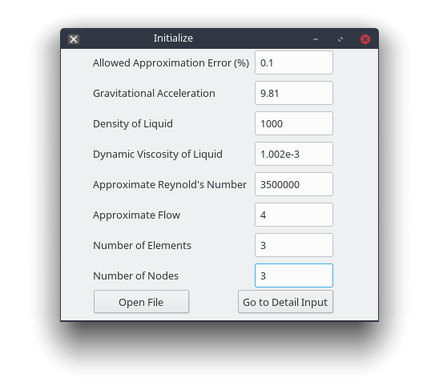
  
Suppose the Problem is such that,  
Head at Node 1 is 0 meter  
Flow out at Node 2 is -0.045m3/s (Negetive because it is flowing out of the system)  
Flow out at Node 3 is -0.035m3/s  
Diameter throughout is 0.243m  
Pump Head is 20.23m  

Then click the 'Go to Detail Input' button  
  
A new window will pop-up.  
'Element Number' is filled automatically and cannot be edited.  
Enter,  
'Flow is from' 'Node' 1 'to' 'Node' 2  

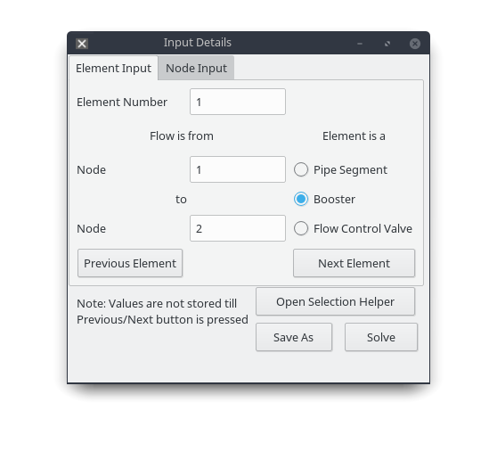

Select the 'Booster' radio button  
A new window will popup.  

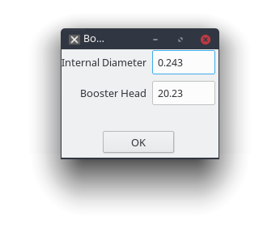

Enter 'Internal Diameter' as .0243m, 'Booster Head' as 20.23m. Click 'OK'  

In 'Input Detail' window click 'Next Element'  
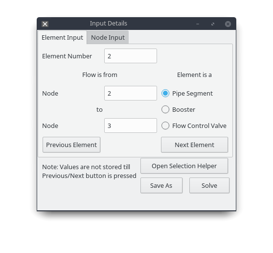

In Similar way to the last Enter 'Flow is from' 'Node' 2 'to' 'Node' 3  

Select 'Pipe Segment' radio button  
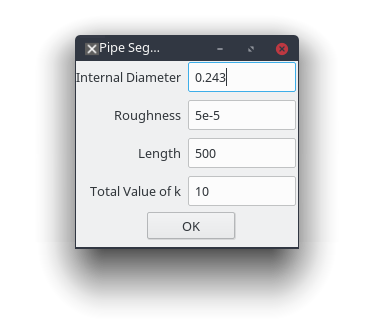

Enter 'Internal Diameter' as .0243m, 'Roughness' as 5e-5m, 'Length' as 500m, and 'Total Value of k' as 10  

In 'Input Detail' window click 'Next Element'  
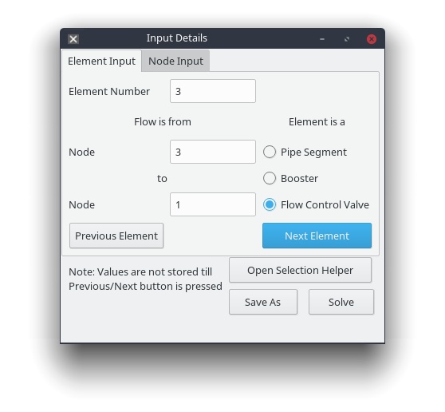

'Flow is from' 'Node' 3 'to' 'Node' 1  
Select 'Flow Control Valve' radio button  
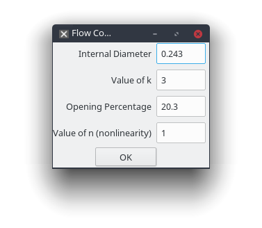

Enter 'Internal Diameter' as .0243m, 'Value of k' as 3, 'Opening Percentage as' as 20.3%, and 'Value of n (nonlinearity)' as 1. Click 'OK'  

In 'Input Details' window click 'Next Element'. THIS STEP IS IMPORTANT TO SAVE THE INPUTS OF LAST ELEMENT.  

Click the Tab 'Node Input'  

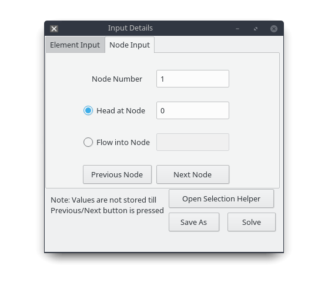
'Node Number' is filled automatically and cannot be edited.  
Select 'Head at Node' radio button and enter 0m. Click 'Next Node'  

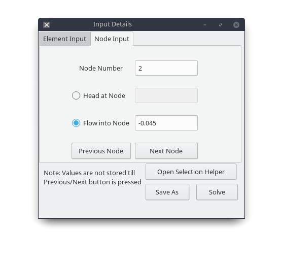

Select 'Flow into Node' radio button and enter -0.045m3/s. Click 'Next Node'  

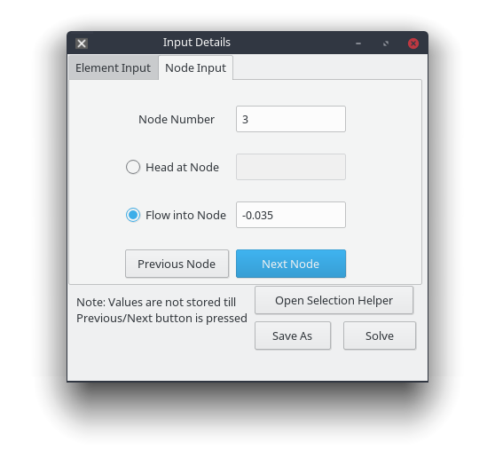

Select 'Flow into Node' radio button and enter -0.035m3/s. Click 'Next Node'. THIS STEP IS IMPORTANT TO SAVE THE INPUTS OF LAST ELEMENT.  

This should activate the button 'Solve' below. Click 'Solve' to view the results of analysis.  
A new 'Results' window should open up. Maximize it to see all the generated data.  

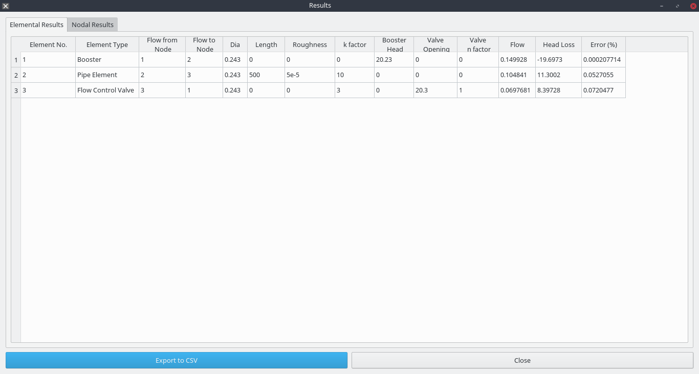

Note: For Booster/Pump there is negetive head loss because Head is added.  
Flow represents the flow through the element. The flow is negetive if your assumption was in the opposite direction during the input.  

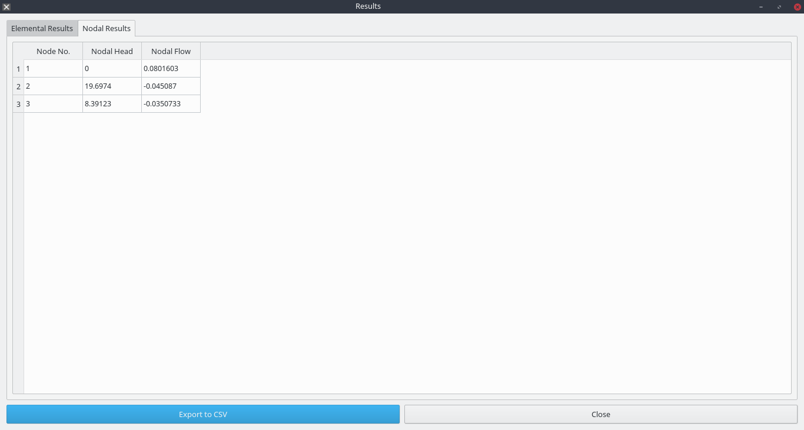

Note: Nodal Flow represents flow into and out of the system. If the flow is going out of the system, the value shall be negetive and vise-versa. If the flow is neither, the value shall be nearly zero.

# How to use Selection Helper

'Selection Helper is particulaly helpful if the difference in head between two nodes are known. Click on 'Open Selection Helper' button on 'Input Details' window.  
A new Window will popup.  

If you need to find Diameter of pipe, you may do so by clicking the radio button 'Calculate Internal Diameter for Pipe Segment.' A Sample Input is given below. Click 'Go' button to know the results.  

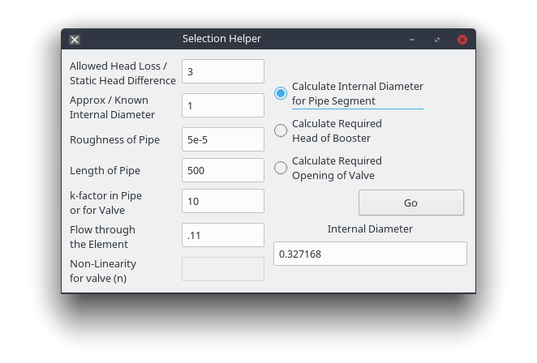

If you need to find total pump or booster head, you may do so by clicking the radio button 'Calculate Required Head of Booster.' A Sample Input is given below. Click 'Go' button to know the results.  

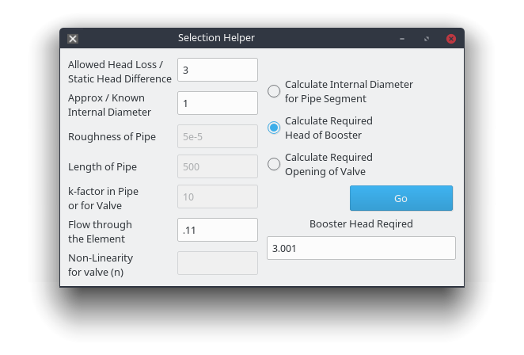

If you need to find percentage of valve opening, you may do so by clicking the radio button 'Calculate Required Opening of Valve.' A Sample Input is given below. Click 'Go' button to know the results.  

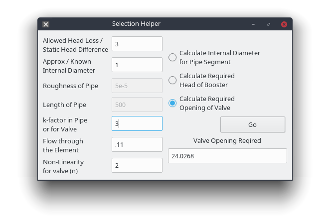

# How to Compile.

    qmake LiquiNet.pro
    make 

